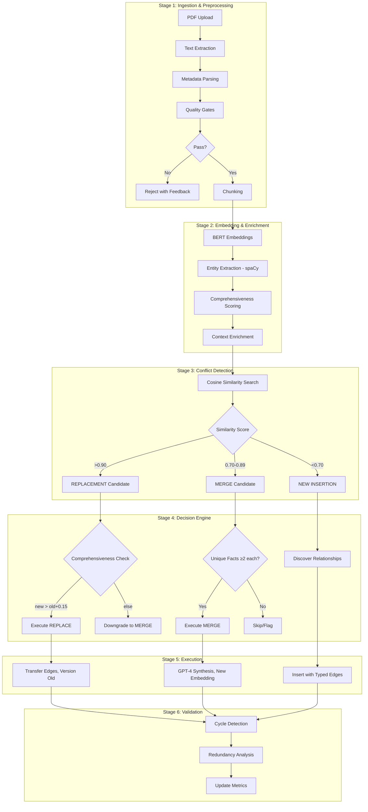

# Dynamic Document Update System - Detailed Implementation Plan

## System Overview

This implements an **intelligent document update pipeline** with semantic conflict resolution. When new documents are uploaded, the system automatically determines whether to:
- **REPLACE**: New content supersedes existing less-comprehensive content
- **MERGE**: Combine complementary information from both sources  
- **INSERT**: Add as new knowledge with typed relationships



---

## Detailed TODO List

### Stage 1: Ingestion & Preprocessing (2 hours)

| # | Task | Priority | Time | Depends On | Status |
|---|------|----------|------|------------|--------|
| 1.1 | Create `DocumentIngester` class | P0 | 30m | - | [ ] |
| 1.2 | Implement PDF upload validation | P0 | 20m | 1.1 | [ ] |
|     | - File type check (PDF only) | | | | [ ] |
|     | - Size limit (50MB max) | | | | [ ] |
|     | - Corruption detection | | | | [ ] |
| 1.3 | Extract metadata during ingestion | P0 | 20m | 1.1 | [ ] |
|     | - Source filename | | | | [ ] |
|     | - Upload timestamp | | | | [ ] |
|     | - Page count | | | | [ ] |
|     | - Authority score (configurable default) | | | | [ ] |
| 1.4 | Implement quality gates | P1 | 20m | 1.3 | [ ] |
|     | - Minimum chunk length (50 words) | | | | [ ] |
|     | - Duplicate detection (exact match hash) | | | | [ ] |
|     | - Language detection (optional) | | | | [ ] |
| 1.5 | Create `DocumentQueue` for batch processing | P2 | 30m | 1.1 | [ ] |

---

### Stage 2: Embedding & Enrichment (2.5 hours)

| # | Task | Priority | Time | Depends On | Status |
|---|------|----------|------|------------|--------|
| 2.1 | Implement context-enriched embeddings | P0 | 45m | Stage 1 | [ ] |
|     | - Embed: chunk + parent document summary | | | | [ ] |
|     | - Store both raw and enriched embeddings | | | | [ ] |
| 2.2 | Add entity extraction with spaCy | P1 | 45m | 2.1 | [ ] |
|     | - Install spacy + en_core_web_sm | | | | [ ] |
|     | - Extract: PERSON, ORG, CONCEPT, TECH | | | | [ ] |
|     | - Store entity-to-chunk mapping | | | | [ ] |
| 2.3 | Implement comprehensiveness scorer | P0 | 30m | 2.1 | [ ] |
|     | - Factors: length, entity density, citation count | | | | [ ] |
|     | - Normalize to 0-1 scale | | | | [ ] |
| 2.4 | Create enrichment metadata store | P1 | 30m | 2.2, 2.3 | [ ] |
|     | - JSON schema for chunk metadata | | | | [ ] |
|     | - Include: entities, score, relationships | | | | [ ] |

---

### Stage 3: Conflict Detection (2 hours)

| # | Task | Priority | Time | Depends On | Status |
|---|------|----------|------|------------|--------|
| 3.1 | Implement `ConflictDetector` class | P0 | 30m | Stage 2 | [ ] |
| 3.2 | Create similarity search function | P0 | 30m | 3.1 | [ ] |
|     | - Search against snippet-level embeddings | | | | [ ] |
|     | - Search against topic-level embeddings | | | | [ ] |
|     | - Return top-5 candidates with scores | | | | [ ] |
| 3.3 | Implement three-tier classification | P0 | 30m | 3.2 | [ ] |
|     | - HIGH (>0.90): REPLACEMENT candidate | | | | [ ] |
|     | - MEDIUM (0.70-0.89): MERGE candidate | | | | [ ] |
|     | - LOW (<0.70): NEW INSERTION | | | | [ ] |
| 3.4 | Add entity overlap detection | P1 | 30m | 3.3 | [ ] |
|     | - "Hidden conflicts": low similarity + high entity overlap | | | | [ ] |
|     | - Threshold: similarity <0.70 but entities >80% overlap → MERGE | | | | [ ] |

---

### Stage 4: Decision Engine (2.5 hours)

| # | Task | Priority | Time | Depends On | Status |
|---|------|----------|------|------------|--------|
| 4.1 | Create `DecisionEngine` class | P0 | 30m | Stage 3 | [ ] |
| 4.2 | Implement REPLACEMENT logic | P0 | 30m | 4.1 | [ ] |
|     | - Condition: new_score > old_score + 0.15 | | | | [ ] |
|     | - OR: age_diff > 180 days | | | | [ ] |
|     | - Else: downgrade to MERGE | | | | [ ] |
| 4.3 | Implement MERGE logic | P0 | 45m | 4.1 | [ ] |
|     | - Use LLM to identify unique facts in each | | | | [ ] |
|     | - Approve if both have ≥2 unique facts | | | | [ ] |
|     | - Atomic integrity: merged output <250 words | | | | [ ] |
|     | - If exceeded: split and link | | | | [ ] |
| 4.4 | Implement NEW INSERTION logic | P1 | 30m | 4.1 | [ ] |
|     | - Discover relationships at 0.50-0.70 similarity | | | | [ ] |
|     | - LLM classifies edge types | | | | [ ] |
|     | - Types: "extends", "supports", "contradicts", "prerequisite_of" | | | | [ ] |
| 4.5 | Add decision logging | P2 | 15m | 4.2-4.4 | [ ] |

---

### Stage 5: Execution (2 hours)

| # | Task | Priority | Time | Depends On | Status |
|---|------|----------|------|------------|--------|
| 5.1 | Create `UpdateExecutor` class | P0 | 20m | Stage 4 | [ ] |
| 5.2 | Execute REPLACEMENT | P0 | 30m | 5.1 | [ ] |
|     | - Transfer graph edges: old_id → new_id | | | | [ ] |
|     | - Mark old: status='superseded' | | | | [ ] |
|     | - Maintain version history | | | | [ ] |
|     | - Propagate updates to dependent chunks | | | | [ ] |
| 5.3 | Execute MERGE | P0 | 40m | 5.1 | [ ] |
|     | - LLM synthesis prompt | | | | [ ] |
|     | - Generate new embedding for merged content | | | | [ ] |
|     | - Create links: merged_from=[old_id1, old_id2] | | | | [ ] |
| 5.4 | Execute NEW INSERTION | P1 | 30m | 5.1 | [ ] |
|     | - Insert into vector database | | | | [ ] |
|     | - Add typed edges to related chunks | | | | [ ] |
|     | - Update topic summaries if joining cluster | | | | [ ] |

---

### Stage 6: Validation & Monitoring (1.5 hours)

| # | Task | Priority | Time | Depends On | Status |
|---|------|----------|------|------------|--------|
| 6.1 | Implement cycle detection | P1 | 30m | Stage 5 | [ ] |
|     | - DFS on prerequisite_of edges | | | | [ ] |
|     | - Alert and prevent cyclic dependencies | | | | [ ] |
| 6.2 | Add redundancy analysis | P2 | 30m | 6.1 | [ ] |
|     | - Louvain community detection on chunks | | | | [ ] |
|     | - Flag clusters with >90% internal similarity | | | | [ ] |
| 6.3 | Create metrics dashboard | P1 | 30m | 6.1, 6.2 | [ ] |
|     | - Conflict type breakdown (R/M/I counts) | | | | [ ] |
|     | - Merge quality score | | | | [ ] |
|     | - Processing time per document | | | | [ ] |

---

## Class Architecture

```python
# src/dynamic_updater.py

class DocumentIngester:
    """Stage 1: Validates and preprocesses uploaded documents."""
    def validate(self, file) -> ValidationResult
    def extract_metadata(self, file) -> Metadata
    def apply_quality_gates(self, chunks) -> List[Chunk]

class EmbeddingEnricher:
    """Stage 2: Generates enriched embeddings and extracts entities."""
    def generate_context_embeddings(self, chunks) -> np.ndarray
    def extract_entities(self, chunk) -> List[Entity]
    def score_comprehensiveness(self, chunk) -> float

class ConflictDetector:
    """Stage 3: Detects conflicts between new and existing content."""
    def find_similar(self, embedding, top_k=5) -> List[SimilarityResult]
    def classify_conflict(self, similarity_score, entity_overlap) -> ConflictType
    
class DecisionEngine:
    """Stage 4: Determines action based on conflict type."""
    def evaluate_replacement(self, new_chunk, old_chunk) -> Decision
    def evaluate_merge(self, chunk1, chunk2) -> Decision
    def discover_relationships(self, new_chunk, candidates) -> List[Relationship]

class UpdateExecutor:
    """Stage 5: Executes the decided action."""
    def execute_replacement(self, new_chunk, old_id) -> ExecutionResult
    def execute_merge(self, chunks) -> ExecutionResult
    def execute_insertion(self, chunk, relationships) -> ExecutionResult

class ValidationMonitor:
    """Stage 6: Validates updates and tracks metrics."""
    def detect_cycles(self) -> List[Cycle]
    def analyze_redundancy(self) -> RedundancyReport
    def get_metrics() -> MetricsReport
```

---

## Configuration

```python
# config additions
CONFLICT_THRESHOLDS = {
    'replacement_min': 0.90,
    'merge_min': 0.70,
    'merge_max': 0.89,
    'relationship_discovery': (0.50, 0.70)
}

COMPREHENSIVENESS_BOOST = 0.15  # Required improvement for replacement
AGE_THRESHOLD_DAYS = 180  # Auto-replace if older than this

MERGE_CONFIG = {
    'min_unique_facts': 2,
    'max_merged_words': 250,
    'synthesis_model': 'gpt-4o-mini'
}
```

---

## Edge Types for Knowledge Graph

| Edge Type | Description | Example |
|-----------|-------------|---------|
| `extends` | Adds depth to existing concept | "B+ tree optimization" extends "B+ tree basics" |
| `supports` | Provides evidence for | "ACID test results" supports "ACID properties" |
| `contradicts` | Conflicts with | Rare; flags for human review |
| `prerequisite_of` | Must understand before | "Normalization" prerequisite_of "Denormalization" |
| `supersedes` | Replaces older version | New lecture replaces old |
| `merged_from` | Result of merge operation | Combined chunk references sources |

---

## Estimated Timeline

| Phase | Time | Cumulative |
|-------|------|------------|
| Stage 1: Ingestion | 2h | 2h |
| Stage 2: Enrichment | 2.5h | 4.5h |
| Stage 3: Conflict Detection | 2h | 6.5h |
| Stage 4: Decision Engine | 2.5h | 9h |
| Stage 5: Execution | 2h | 11h |
| Stage 6: Validation | 1.5h | 12.5h |
| Integration & Testing | 2h | 14.5h |
| **Total** | **14.5h** | |

---

## Dependencies to Add

```txt
# requirements.txt additions
spacy>=3.5.0
networkx>=3.0  # For graph operations and cycle detection
python-louvain>=0.16  # For community detection
```
