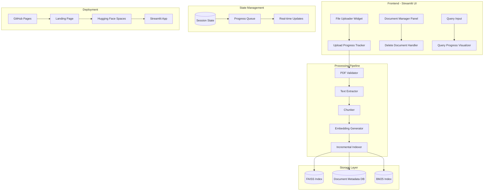
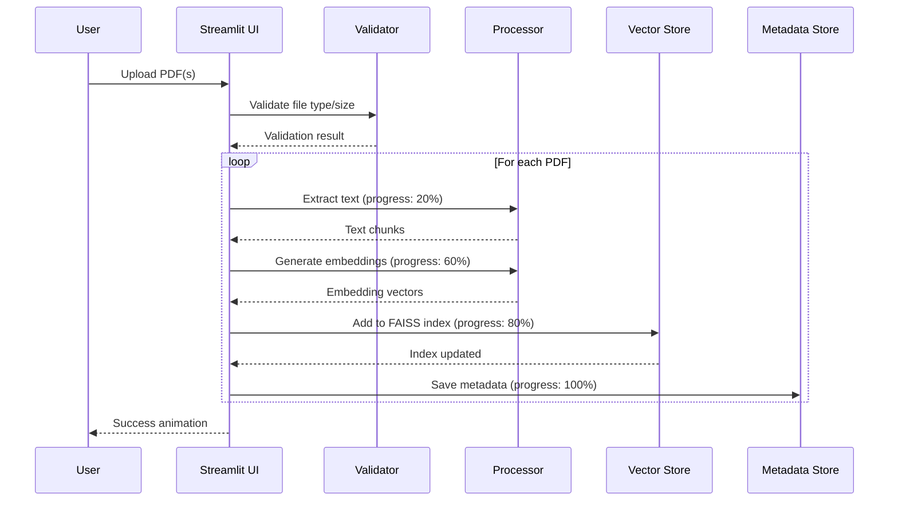

# RAG System Enhancement & Deployment Plan

## Executive Summary

This plan outlines the implementation of three major enhancements to the ADB Course RAG system:

1. **Dynamic Document Upload**: Allow users to upload PDFs via UI with incremental vector store updates, eliminating the need to rebuild the entire index.
2. **Beautiful Progress Visualization**: Modern, animated feedback system showing real-time processing stages with glassmorphism design.
3. **Cloud Deployment**: Deploy on **Hugging Face Spaces** (free tier, perfect for Streamlit) with a GitHub Pages landing page.

**Timeline**: 12-15 hours | **Cost**: $0 (free tier services) | **Complexity**: Medium-High

---

## 1. Technical Architecture

### 1.1 Updated System Architecture



### 1.2 Document Upload Data Flow



### 1.3 State Management Strategy

```python
# Session state structure for progress tracking
st.session_state['upload_progress'] = {
    'current_stage': 'idle',  # idle, validating, extracting, chunking, embedding, indexing, complete
    'stage_progress': 0.0,     # 0.0 - 1.0
    'total_files': 0,
    'processed_files': 0,
    'current_file': '',
    'chunks_created': 0,
    'embeddings_generated': 0,
    'errors': [],
    'start_time': None,
    'estimated_remaining': 0
}
```

---

## 2. Detailed Implementation Plan

### Phase 1: Dynamic Document Upload (5-6 hours)

#### 1.1 File Upload UI Component
**Priority**: P0 | **Time**: 1.5 hours

```python
# Component structure
def document_upload_section():
    uploaded_files = st.file_uploader(
        "Upload PDF Documents",
        type=['pdf'],
        accept_multiple_files=True,
        help="Upload course materials to add to the knowledge base"
    )
    
    if uploaded_files:
        for file in uploaded_files:
            if validate_pdf(file):
                process_document(file)
```

**Acceptance Criteria**:
- [ ] File uploader accepts PDF only
- [ ] Max file size: 50MB per file
- [ ] Max 10 files per upload batch
- [ ] Drag-and-drop support
- [ ] File previews before processing

#### 1.2 Incremental Vector Store Update
**Priority**: P0 | **Time**: 2 hours

```python
# Incremental indexing logic
class IncrementalIndexer:
    def add_documents(self, new_docs: List[Document]) -> bool:
        """Add documents without rebuilding entire index."""
        # Generate embeddings for new docs only
        new_embeddings = self.embedding_manager.embed_documents(
            [doc.content for doc in new_docs]
        )
        
        # Add to existing FAISS index
        self.faiss_index.add(np.array(new_embeddings))
        
        # Update document metadata mapping
        start_idx = len(self.documents)
        for i, doc in enumerate(new_docs):
            self.doc_id_map[start_idx + i] = doc.metadata
        
        # Update BM25 index
        self.bm25_index.add_documents([doc.content for doc in new_docs])
        
        # Persist changes
        self.save()
        return True
```

**Acceptance Criteria**:
- [ ] New documents added without full rebuild
- [ ] Index persists across sessions
- [ ] BM25 and FAISS stay synchronized
- [ ] Rollback on failure

#### 1.3 Document Management Panel
**Priority**: P1 | **Time**: 1.5 hours

**Features**:
- List all indexed documents with metadata
- Search/filter documents by name
- Delete documents (with confirmation)
- View document statistics (chunks, pages)

```python
def document_manager_panel():
    st.subheader("📚 Document Library")
    
    docs = get_indexed_documents()
    
    for doc in docs:
        col1, col2, col3 = st.columns([3, 1, 1])
        with col1:
            st.text(f"📄 {doc['filename']}")
        with col2:
            st.caption(f"{doc['chunks']} chunks")
        with col3:
            if st.button("🗑️", key=f"del_{doc['id']}"):
                delete_document(doc['id'])
                st.rerun()
```

#### 1.4 Document Deletion Logic
**Priority**: P1 | **Time**: 1 hour

```python
def delete_document(doc_id: str):
    """Remove document and its chunks from all indexes."""
    # Get chunk IDs for this document
    chunk_ids = get_chunks_for_document(doc_id)
    
    # Remove from FAISS (requires rebuild of affected portion)
    # Strategy: Mark as deleted, rebuild periodically
    mark_chunks_deleted(chunk_ids)
    
    # Remove from BM25
    self.bm25_index.remove_documents(chunk_ids)
    
    # Update metadata
    remove_document_metadata(doc_id)
```

---

### Phase 2: Progress Visualization System (4-5 hours)

#### 2.1 Progress Tracking Infrastructure
**Priority**: P0 | **Time**: 1 hour

```python
# Progress stages and weights
UPLOAD_STAGES = {
    'validating': {'weight': 0.05, 'label': '🔍 Validating'},
    'extracting': {'weight': 0.25, 'label': '📝 Extracting Text'},
    'chunking': {'weight': 0.15, 'label': '✂️ Chunking'},
    'embedding': {'weight': 0.40, 'label': '🧠 Generating Embeddings'},
    'indexing': {'weight': 0.10, 'label': '📊 Updating Index'},
    'complete': {'weight': 0.05, 'label': '✅ Complete'}
}

def update_progress(stage: str, progress: float, metrics: dict):
    """Thread-safe progress update."""
    st.session_state['upload_progress'].update({
        'current_stage': stage,
        'stage_progress': progress,
        **metrics
    })
```

#### 2.2 Visual Progress Components
**Priority**: P0 | **Time**: 2 hours

**Custom CSS for Glassmorphism Progress**:
```css
.progress-container {
    background: rgba(255, 255, 255, 0.1);
    backdrop-filter: blur(10px);
    border-radius: 16px;
    padding: 24px;
    border: 1px solid rgba(255, 255, 255, 0.2);
    box-shadow: 0 8px 32px rgba(0, 0, 0, 0.3);
}

.progress-bar {
    height: 8px;
    border-radius: 4px;
    background: linear-gradient(90deg, #3B82F6, #8B5CF6);
    transition: width 0.3s ease;
    position: relative;
    overflow: hidden;
}

.progress-bar::after {
    content: '';
    position: absolute;
    top: 0;
    left: 0;
    width: 100%;
    height: 100%;
    background: linear-gradient(90deg, transparent, rgba(255,255,255,0.3), transparent);
    animation: shimmer 1.5s infinite;
}

@keyframes shimmer {
    0% { transform: translateX(-100%); }
    100% { transform: translateX(100%); }
}

.stage-indicator {
    display: flex;
    gap: 12px;
    margin-bottom: 16px;
}

.stage-dot {
    width: 12px;
    height: 12px;
    border-radius: 50%;
    background: #334155;
    transition: all 0.3s ease;
}

.stage-dot.active {
    background: #3B82F6;
    box-shadow: 0 0 12px #3B82F6;
    animation: pulse 1s infinite;
}

.stage-dot.complete {
    background: #10B981;
}

@keyframes pulse {
    0%, 100% { transform: scale(1); }
    50% { transform: scale(1.2); }
}
```

**Progress Component**:
```python
def render_upload_progress():
    progress = st.session_state.get('upload_progress', {})
    
    if progress.get('current_stage') == 'idle':
        return
    
    st.markdown("""
    <div class="progress-container">
        <div class="stage-indicator">
            <!-- Stage dots rendered dynamically -->
        </div>
        <div class="progress-bar" style="width: {progress}%"></div>
        <div class="progress-stats">
            <span>📄 {files_processed}/{total_files} files</span>
            <span>📦 {chunks} chunks</span>
            <span>⏱️ {time_remaining}s remaining</span>
        </div>
    </div>
    """, unsafe_allow_html=True)
```

#### 2.3 Query Journey Visualization
**Priority**: P1 | **Time**: 1.5 hours

```python
def render_query_journey(stages: dict):
    """Visualize the RAG pipeline stages during query processing."""
    
    journey_html = """
    <div class="query-journey">
        <div class="journey-step {status_embed}">
            <div class="step-icon">🔤</div>
            <div class="step-label">Embedding Query</div>
            <div class="step-time">{embed_time}ms</div>
        </div>
        <div class="journey-connector"></div>
        <div class="journey-step {status_retrieve}">
            <div class="step-icon">🔍</div>
            <div class="step-label">Retrieving</div>
            <div class="step-time">{retrieve_time}ms</div>
        </div>
        <div class="journey-connector"></div>
        <div class="journey-step {status_generate}">
            <div class="step-icon">✨</div>
            <div class="step-label">Generating</div>
            <div class="step-time">{generate_time}ms</div>
        </div>
    </div>
    """
    st.markdown(journey_html.format(**stages), unsafe_allow_html=True)
```

#### 2.4 Success/Error Animations
**Priority**: P2 | **Time**: 0.5 hours

```python
def show_success_animation():
    st.markdown("""
    <div class="success-animation">
        <svg class="checkmark" viewBox="0 0 52 52">
            <circle class="checkmark-circle" cx="26" cy="26" r="25" fill="none"/>
            <path class="checkmark-check" fill="none" d="M14.1 27.2l7.1 7.2 16.7-16.8"/>
        </svg>
        <p>Document added successfully!</p>
    </div>
    """, unsafe_allow_html=True)
```

---

### Phase 3: Deployment (3-4 hours)

#### 3.1 Hugging Face Spaces Deployment
**Priority**: P0 | **Time**: 1.5 hours

**Why Hugging Face Spaces?**
- ✅ Free tier with generous limits
- ✅ Native Streamlit support
- ✅ Automatic HTTPS
- ✅ Git-based deployment
- ✅ Secrets management built-in
- ✅ Community visibility

**Steps**:
1. Create `requirements.txt` (already done)
2. Create HF Space configuration
3. Push code to HF
4. Configure secrets

**`README.md` for HF Spaces**:
```markdown
---
title: ADB Course RAG System
emoji: 📚
colorFrom: blue
colorTo: purple
sdk: streamlit
sdk_version: 1.28.0
app_file: app.py
pinned: false
---
```

#### 3.2 GitHub Pages Landing Page
**Priority**: P1 | **Time**: 1.5 hours

Create a beautiful landing page at `https://abdulrahmann-omar.github.io/rag-adb-system/`

**Landing Page Structure**:
```
docs/
├── index.html
├── styles.css
├── script.js
└── assets/
    ├── demo.gif
    ├── architecture.png
    └── logo.svg
```

#### 3.3 CI/CD Pipeline
**Priority**: P1 | **Time**: 1 hour

**`.github/workflows/deploy.yml`**:
```yaml
name: Deploy to HuggingFace Spaces

on:
  push:
    branches: [master]

jobs:
  deploy:
    runs-on: ubuntu-latest
    steps:
      - uses: actions/checkout@v3
      
      - name: Push to HuggingFace
        env:
          HF_TOKEN: ${{ secrets.HF_TOKEN }}
        run: |
          git remote add hf https://huggingface.co/spaces/${{ secrets.HF_USERNAME }}/rag-adb-system
          git push hf master --force
```

---

## 3. Professional TODO List

### Phase 1: Dynamic Document Upload
| Task | Priority | Time | Status | Dependencies |
|------|----------|------|--------|--------------|
| [ ] Create file uploader component | P0 | 1h | ⬜ | - |
| [ ] Implement PDF validation (type, size, corruption) | P0 | 0.5h | ⬜ | Uploader |
| [ ] Build incremental FAISS indexer | P0 | 1.5h | ⬜ | - |
| [ ] Implement incremental BM25 updater | P0 | 0.5h | ⬜ | - |
| [ ] Create document metadata store (JSON) | P1 | 0.5h | ⬜ | - |
| [ ] Build document manager UI panel | P1 | 1h | ⬜ | Metadata |
| [ ] Implement document deletion with cleanup | P1 | 1h | ⬜ | Manager |
| [ ] Add upload error handling & retry | P2 | 0.5h | ⬜ | Uploader |
| [ ] Write unit tests for indexer | P2 | 0.5h | ⬜ | Indexer |

### Phase 2: Progress Visualization
| Task | Priority | Time | Status | Dependencies |
|------|----------|------|--------|--------------|
| [ ] Design progress state schema | P0 | 0.5h | ⬜ | - |
| [ ] Create glassmorphism CSS framework | P0 | 1h | ⬜ | - |
| [ ] Build multi-stage progress bar | P0 | 1h | ⬜ | CSS |
| [ ] Implement real-time metrics display | P1 | 0.5h | ⬜ | Progress bar |
| [ ] Add stage indicator dots | P1 | 0.5h | ⬜ | CSS |
| [ ] Create query journey visualizer | P1 | 1h | ⬜ | CSS |
| [ ] Add success/error animations | P2 | 0.5h | ⬜ | CSS |
| [ ] Implement ETA calculator | P2 | 0.5h | ⬜ | Progress |
| [ ] Cross-browser testing | P2 | 0.5h | ⬜ | All UI |

### Phase 3: Deployment
| Task | Priority | Time | Status | Dependencies |
|------|----------|------|--------|--------------|
| [ ] Create HuggingFace Space | P0 | 0.5h | ⬜ | - |
| [ ] Configure HF secrets (GITHUB_TOKEN) | P0 | 0.25h | ⬜ | HF Space |
| [ ] Deploy app to HF Spaces | P0 | 0.5h | ⬜ | Config |
| [ ] Create GitHub Pages landing page | P1 | 1h | ⬜ | - |
| [ ] Add demo GIF to landing page | P1 | 0.5h | ⬜ | Landing |
| [ ] Configure GitHub Actions CI/CD | P1 | 0.5h | ⬜ | HF deploy |
| [ ] Add monitoring (HF built-in) | P2 | 0.25h | ⬜ | Deploy |
| [ ] Write deployment documentation | P2 | 0.5h | ⬜ | All |

---

## 4. Risk Assessment & Mitigation

| Risk | Probability | Impact | Mitigation |
|------|------------|--------|------------|
| FAISS incremental add complexity | Medium | High | Use `faiss.IndexFlatL2` which supports `add()` natively |
| Large file upload timeout | Medium | Medium | Implement chunked upload, set timeout to 5min |
| HF Spaces cold start | High | Low | Add warming script, document expected delay |
| Memory limits on free tier | Medium | High | Limit concurrent documents, lazy loading |
| Browser animation performance | Low | Medium | Use CSS animations over JS, reduce particles |

---

## 5. Testing Strategy

### Unit Tests
```python
# tests/test_incremental_indexer.py
def test_add_single_document():
    indexer = IncrementalIndexer()
    initial_count = indexer.document_count
    
    indexer.add_documents([sample_doc])
    
    assert indexer.document_count == initial_count + 1
    assert indexer.search("sample query")[0].source == sample_doc.source

def test_delete_document():
    indexer = IncrementalIndexer()
    doc_id = indexer.add_documents([sample_doc])[0]
    
    indexer.delete_document(doc_id)
    
    assert doc_id not in indexer.get_all_doc_ids()
```

### Integration Tests
- [ ] Upload → Process → Search flow
- [ ] Delete → Verify removal from search
- [ ] Multiple concurrent uploads
- [ ] Error recovery scenarios

### Performance Benchmarks
- Upload processing: < 30s for 10-page PDF
- Index update: < 5s for single document
- Search latency: < 500ms after update

---

## 6. Deployment Checklist

### Pre-Deployment
- [ ] All tests passing
- [ ] requirements.txt updated
- [ ] Secrets removed from code
- [ ] .gitignore includes .env
- [ ] README updated with deploy instructions

### Deployment Steps
1. [ ] Create HuggingFace account (if needed)
2. [ ] Create new Space: `Streamlit` SDK
3. [ ] Clone Space repo locally
4. [ ] Copy project files (exclude venv, .env, data/)
5. [ ] Add secrets via HF UI: GITHUB_TOKEN
6. [ ] Push to HF Space
7. [ ] Verify app loads at `huggingface.co/spaces/username/rag-adb-system`

### Post-Deployment
- [ ] Test all features on live site
- [ ] Share link on GitHub README
- [ ] Set up GitHub Pages landing page
- [ ] Configure CI/CD for auto-deploy

---

## 7. Recommended Timeline

```
Day 1 (6 hours):
├── Phase 1: Dynamic Upload (5h)
│   ├── File uploader + validation (1.5h)
│   ├── Incremental indexer (2h)
│   └── Document manager UI (1.5h)
└── Phase 2 Start: Progress CSS (1h)

Day 2 (5 hours):
├── Phase 2: Progress Visualization (3.5h)
│   ├── Progress components (1.5h)
│   ├── Query journey viz (1h)
│   └── Animations (1h)
└── Phase 3: Deployment (1.5h)
    ├── HF Spaces setup (1h)
    └── GitHub Pages landing (0.5h)

Day 3 (2 hours):
├── CI/CD setup (0.5h)
├── Testing & bug fixes (1h)
└── Documentation (0.5h)
```

---

## 8. Next Steps

Would you like me to start implementing these features? I recommend this order:

1. **First**: Incremental indexer (core functionality)
2. **Second**: File upload UI with progress
3. **Third**: Deploy to HuggingFace Spaces
4. **Fourth**: GitHub Pages landing page

**Ready to begin implementation?**
