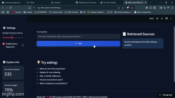
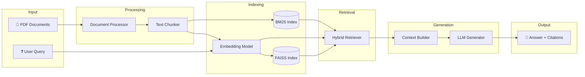

# 🤖 RAG System for Advanced Database Course

### Intelligent Q&A System Powered by Retrieval-Augmented Generation

[](https://www.python.org/downloads/)
[](https://streamlit.io/)
[](LICENSE)
[](https://github.com/facebookresearch/faiss)
[](https://rag-adb-system.streamlit.app/)

[🚀 Live Demo](https://rag-adb-system.streamlit.app/) | [📖 Documentation](./docs/) | [✨ Features](#-features)



---

## 📋 Overview

**Problem**: Students often need quick, accurate answers from extensive course materials spread across multiple PDF documents.

**Solution**: This RAG (Retrieval-Augmented Generation) system enables intelligent Q&A over Advanced Database course materials by:

1. **Processing** PDF documents into searchable chunks
2. **Indexing** content using semantic embeddings (FAISS) and keyword search (BM25)
3. **Retrieving** the most relevant passages using hybrid search
4. **Generating** accurate, contextual answers with citations via LLM

### 🎯 Key Features

| Feature | Description |
|---------|-------------|
| 🔍 **Hybrid Retrieval** | Combines semantic (70%) and keyword (30%) search for optimal results |
| 🧠 **Self-Learning** | Improves over time based on user feedback |
| 📊 **Progress Visualization** | Real-time processing indicators with beautiful UI |
| 📤 **Dynamic Upload** | Add new documents without rebuilding the entire index |
| 📑 **Source Citations** | Every answer includes relevant source passages |
| 🎨 **Modern UI** | Professional dark-mode Streamlit interface |

---

## 🏗️ Architecture



### Components

| Component | Technology | Purpose |
|-----------|------------|---------|
| **Document Processor** | pdfplumber | Extract text from PDF files |
| **Text Splitter** | LangChain | Chunk text with overlap for context preservation |
| **Embeddings** | all-MiniLM-L6-v2 | 384-dim semantic vectors |
| **Vector Store** | FAISS | Fast similarity search |
| **Keyword Search** | BM25 | Traditional keyword matching |
| **LLM** | GitHub Models (GPT-4o-mini) | Context-aware answer generation |
| **UI** | Streamlit | Interactive web interface |

---

## 🚀 Quick Start

### Prerequisites

- Python 3.10+
- GitHub Personal Access Token with Models API access ([Get one here](https://github.com/settings/tokens))

### Installation

1. **Clone the repository**
   ```bash
   git clone https://github.com/abdulrahmann-omar/rag-adb-system.git
   cd rag-adb-system
   ```

2. **Create virtual environment**
   ```bash
   python -m venv venv
   
   # Windows
   venv\Scripts\activate
   
   # macOS/Linux
   source venv/bin/activate
   ```

3. **Install dependencies**
   ```bash
   pip install -r requirements.txt
   ```

4. **Configure environment**
   ```bash
   cp .env.example .env
   # Edit .env and add your GITHUB_TOKEN
   ```

5. **Run the application**
   ```bash
   streamlit run app.py
   ```

6. **Open browser**: Navigate to `http://localhost:8501`

---

## 💡 Usage

### 1. Upload Documents

- Click **"📤 Upload PDF"** in the sidebar
- Select one or more PDF files
- Click **"📥 Process Uploads"**
- Watch real-time processing with stage indicators

### 2. Ask Questions

**Example queries:**
- "What are the ACID properties in databases?"
- "Explain B+ tree indexing with examples"
- "Compare NoSQL vs SQL for large-scale systems"
- "What is query optimization?"

### 3. View Sources

- Each answer displays retrieved source passages
- See relevance scores for transparency
- Review original context from course materials

### 4. Provide Feedback

- Rate answers with 👍 (Helpful) or 👎 (Not Helpful)
- System learns from feedback to improve future retrievals
- View learning statistics in the sidebar

---

## ✨ Features

### Hybrid Retrieval System

```python
# Weighted score fusion
final_score = (0.7 × semantic_score) + (0.3 × keyword_score)
```

- **Semantic Search**: Understands meaning and context
- **Keyword Search**: Catches exact terminology and acronyms
- **Score Fusion**: Balances both approaches for optimal results

### Self-Learning Capabilities

- ✅ User feedback collection (positive/negative ratings)
- ✅ Query expansion for ambiguous questions
- ✅ Adaptive retrieval based on query complexity
- ✅ Performance analytics in sidebar

### Progress Visualization

- 🎨 Multi-stage pipeline indicators
- ⏱️ Real-time metrics (time, chunks, progress)
- 📊 Beautiful dark-mode UI with animations
- ✅ Success/error state handling

---

## ⚙️ Configuration

Edit `.env` or `src/config.py`:

| Variable | Description | Default |
|----------|-------------|---------|
| `GITHUB_TOKEN` | GitHub Models API key | *Required* |
| `MODEL_NAME` | LLM model to use | `gpt-4o-mini` |
| `EMBEDDING_MODEL` | Sentence transformer model | `all-MiniLM-L6-v2` |
| `CHUNK_SIZE` | Characters per text chunk | `1000` |
| `CHUNK_OVERLAP` | Overlap between chunks | `200` |
| `TOP_K` | Number of retrieved passages | `5` |

---

## 📁 Project Structure

```
rag-adb-system/
├── src/                      # Source code modules
│   ├── config.py             # Configuration management
│   ├── document_processor.py # PDF extraction & chunking
│   ├── vector_store.py       # FAISS & BM25 indexing
│   ├── retriever.py          # Hybrid retrieval logic
│   ├── generator.py          # LLM integration
│   ├── self_learning.py      # Feedback & learning system
│   ├── dynamic_updater.py    # Dynamic document updates
│   ├── progress_viz.py       # Progress visualization
│   └── utils.py              # Helper functions
├── data/                     # Data storage (gitignored)
│   ├── processed/            # Extracted text
│   └── vector_store/         # FAISS index files
├── docs/                     # Documentation
│   ├── architecture.md       # System architecture
│   ├── api_reference.md      # API documentation
│   ├── deployment.md         # Deployment guide
│   └── development.md        # Developer guide
├── logs/                     # Query & feedback logs
├── .github/                  # GitHub workflows & templates
├── app.py                    # Main Streamlit application
├── main.py                   # CLI interface
├── requirements.txt          # Python dependencies
├── .env.example              # Environment template
├── LICENSE                   # MIT License
├── CONTRIBUTING.md           # Contribution guidelines
└── README.md                 # This file
```

---

## 📊 Performance

| Metric | Value |
|--------|-------|
| Query Latency | ~2-3s average |
| Embedding Speed | ~50 chunks/sec |
| Retrieval Accuracy | Hybrid outperforms single-method |
| Index Size | ~2MB per 100 documents |

---

## 🗺️ Roadmap

- [x] Core RAG pipeline
- [x] Hybrid retrieval (semantic + BM25)
- [x] Self-learning feedback system
- [x] Real-time progress visualization
- [x] Dynamic document upload
- [x] Beautiful dark-mode UI
- [ ] Multi-language support
- [ ] Advanced query understanding (NER, intent)
- [ ] Graph-based retrieval
- [ ] Fine-tuned domain embeddings

---

## 📚 Documentation

- [Architecture Details](docs/architecture.md)
- [API Reference](docs/api_reference.md)
- [Deployment Guide](docs/deployment.md)
- [Development Guide](docs/development.md)

---

## 🤝 Contributing

Contributions are welcome! Please read [CONTRIBUTING.md](CONTRIBUTING.md) for guidelines.

1. Fork the repository
2. Create feature branch (`git checkout -b feature/amazing-feature`)
3. Commit changes (`git commit -m 'Add amazing feature'`)
4. Push to branch (`git push origin feature/amazing-feature`)
5. Open Pull Request

---

## 📄 License

This project is licensed under the MIT License - see the [LICENSE](LICENSE) file for details.

---

## 🙏 Acknowledgments

- **[LangChain](https://langchain.com/)** - RAG framework and text processing
- **[Sentence Transformers](https://www.sbert.net/)** - Embedding models
- **[FAISS](https://github.com/facebookresearch/faiss)** - Vector similarity search
- **[Streamlit](https://streamlit.io/)** - Web UI framework
- **[GitHub Models](https://github.com/marketplace/models)** - LLM API

---

## 👨‍💻 Author

**Abdulrahman Omar** - Advanced Database Course Project

[](https://github.com/abdulrahmann-omar)
[](https://www.linkedin.com/in/abdulrahman-omar-87121b200/)

📧 Contact: abdu.omar.muhammad@gmail.com

---

⭐ **Star this repo if you find it helpful!**
