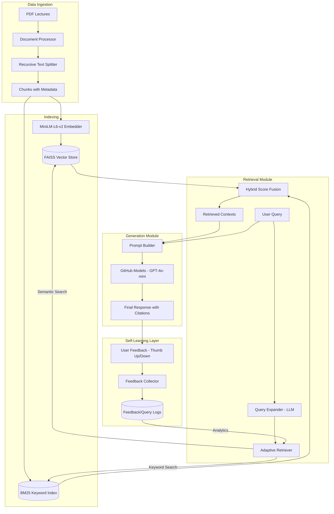

# ADB Course RAG System - Architecture

## System Overview
The system follows a standard RAG architecture enhanced with hybrid retrieval (Dense + Sparse) and a self-learning feedback loop.

## Key Components
1. **Hybrid Search**: Combines semantic understanding (FAISS) with exact keyword matching (BM25) to handle technical database terminology effectively.
2. **Query Expansion**: Uses the LLM to rephrase short or ambiguous queries into detailed search prompts.
3. **Adaptive Retrieval**: Adjusts the number of retrieved documents (`top_k`) based on the confidence scores of the initial retrieval.
4. **Citation Engine**: Automatically maps retrieved chunks back to their source PDF and page number for academic integrity.
