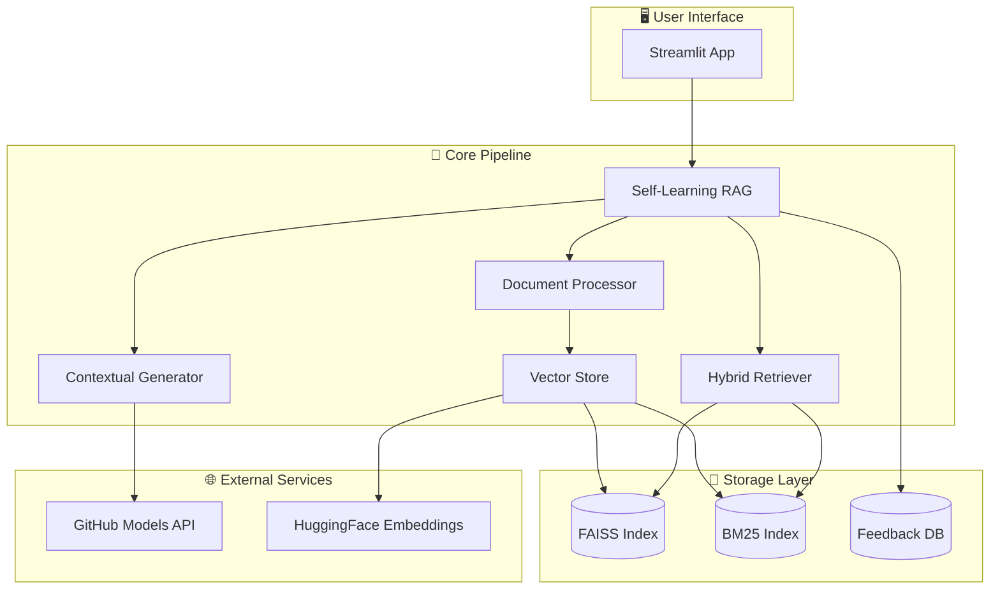
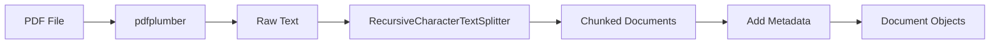
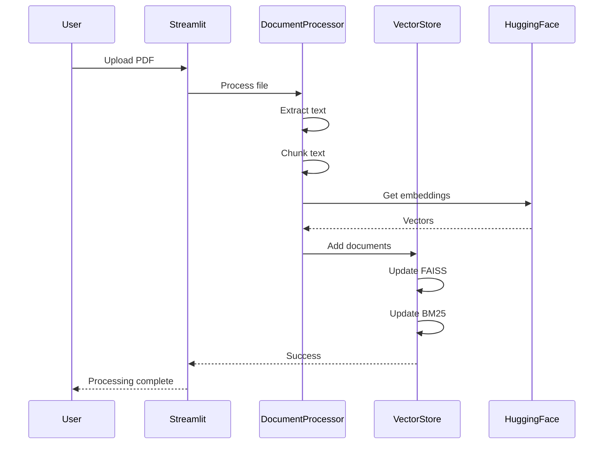
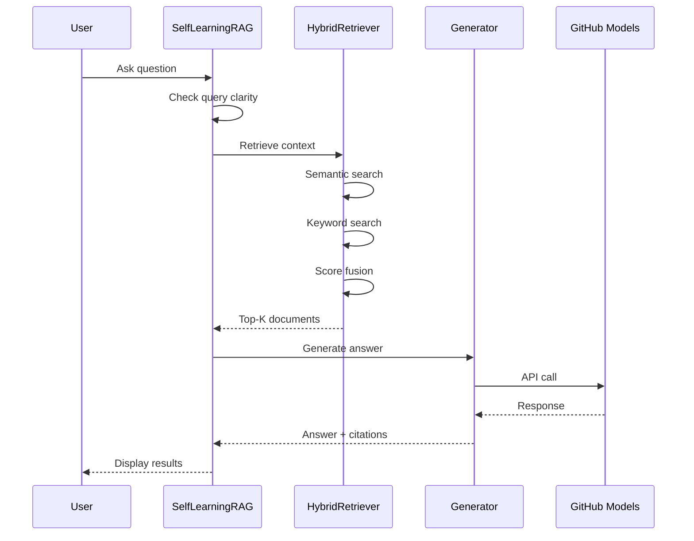

# System Architecture

Comprehensive technical documentation of the RAG system architecture.

## High-Level Overview



---

## Component Details

### 1. Document Processor

**File**: `src/document_processor.py`

**Purpose**: Extracts text from PDF files and splits into overlapping chunks for indexing.

| Aspect | Details |
|--------|---------|
| **Inputs** | PDF file paths |
| **Outputs** | List of `Document` objects with content and metadata |
| **Dependencies** | `pdfplumber`, `langchain.text_splitter` |

**Configuration**:
- `CHUNK_SIZE`: 1000 characters (tunable: 500-2000)
- `CHUNK_OVERLAP`: 200 characters (tunable: 0-500)

**Processing Flow**:


---

### 2. Vector Store

**File**: `src/vector_store.py`

**Purpose**: Manages FAISS vector index and BM25 keyword index for document storage and retrieval.

| Aspect | Details |
|--------|---------|
| **Inputs** | Document chunks, query embeddings |
| **Outputs** | Ranked document results |
| **Dependencies** | `faiss-cpu`, `rank-bm25`, `sentence-transformers` |

**Key Features**:
- Dual-index architecture (semantic + keyword)
- Automatic persistence to disk
- Dynamic document addition/removal
- Source tracking with metadata

**Index Structure**:
```
data/vector_store/
├── faiss_index.bin     # FAISS binary index
├── documents.pkl       # Document content & metadata
└── bm25_index.pkl      # BM25 tokenized corpus
```

---

### 3. Hybrid Retriever

**File**: `src/retriever.py`

**Purpose**: Combines semantic and keyword search results using weighted score fusion.

| Aspect | Details |
|--------|---------|
| **Inputs** | User query string |
| **Outputs** | Top-K relevant documents with scores |
| **Dependencies** | `vector_store.py` |

**Score Fusion Formula**:
```python
final_score = (SEMANTIC_WEIGHT × semantic_score) + (KEYWORD_WEIGHT × bm25_score)
# Default: 0.7 × semantic + 0.3 × keyword
```

**Why Hybrid?**
- Semantic search: Understands meaning, handles paraphrases
- Keyword search: Catches exact terms, acronyms, technical jargon
- Combined: Best of both worlds

---

### 4. Contextual Generator

**File**: `src/generator.py`

**Purpose**: Generates answers using retrieved context and LLM.

| Aspect | Details |
|--------|---------|
| **Inputs** | User query, retrieved context chunks |
| **Outputs** | Generated answer with citations |
| **Dependencies** | `openai` (GitHub Models compatible) |

**Prompt Template**:
```
You are an expert teaching assistant for an Advanced Databases course.
Answer the question based ONLY on the provided context.
If the context doesn't contain relevant information, say so.

Context: {retrieved_chunks}

Question: {user_query}

Provide a clear, educational answer with specific references to the source material.
```

**Configuration**:
- Model: `gpt-4o-mini` (default)
- Temperature: 0.7
- Max tokens: 1000

---

### 5. Self-Learning RAG

**File**: `src/self_learning.py`

**Purpose**: Orchestrates the RAG pipeline with feedback collection and adaptive behavior.

| Aspect | Details |
|--------|---------|
| **Inputs** | User queries, feedback signals |
| **Outputs** | Complete RAG responses with metadata |
| **Dependencies** | All other components |

**Self-Learning Features**:

1. **Feedback Collection**
   - Stores user ratings (positive/negative)
   - Tracks query-response pairs

2. **Query Expansion**
   - Detects ambiguous queries
   - Expands with additional context terms

3. **Adaptive Retrieval**
   - Adjusts Top-K based on query complexity
   - Modifies weights based on feedback patterns

---

### 6. Dynamic Update Pipeline

**File**: `src/dynamic_updater.py`

**Purpose**: Enables adding new documents without full reindexing.

| Aspect | Details |
|--------|---------|
| **Inputs** | New PDF files |
| **Outputs** | Updated vector store |
| **Dependencies** | `document_processor.py`, `vector_store.py` |

**Update Stages**:


---

## Data Flow Diagrams

### Document Upload Flow



### Query Flow



---

## Design Decisions

### Why FAISS?

| Considered | Chosen | Reason |
|------------|--------|--------|
| ChromaDB | FAISS | Faster for small-medium datasets, no server needed |
| Pinecone | FAISS | Free, no API limits, local-first |
| Weaviate | FAISS | Simpler setup, sufficient for course materials |

### Why all-MiniLM-L6-v2?

| Considered | Chosen | Reason |
|------------|--------|--------|
| OpenAI Ada | MiniLM | Free, no API costs |
| BGE-large | MiniLM | Faster inference, good quality tradeoff |
| Custom fine-tuned | MiniLM | Works well out-of-box for academic text |

### Why Hybrid Retrieval?

| Approach | Limitation | Solution |
|----------|------------|----------|
| Semantic only | Misses exact acronyms (ACID, SQL) | Add BM25 |
| Keyword only | Misses paraphrases | Add semantic |
| Hybrid (0.7/0.3) | Best of both worlds | ✅ Chosen |

### Why GitHub Models?

| Considered | Chosen | Reason |
|------------|--------|--------|
| OpenAI direct | GitHub Models | Free tier, same API format |
| Ollama local | GitHub Models | No local GPU required |
| Anthropic | GitHub Models | OpenAI-compatible, easy migration |

---

## Performance Characteristics

| Component | Latency | Memory |
|-----------|---------|--------|
| PDF Extraction | ~1s/page | ~50MB |
| Embedding | ~20ms/chunk | ~500MB (model) |
| FAISS Search | <10ms | ~2MB/1000 docs |
| BM25 Search | <5ms | ~1MB/1000 docs |
| LLM Generation | 1-2s | N/A (API) |
| **Total Query** | **2-3s** | **~600MB** |

---

## Security Considerations

1. **API Keys**: Stored in `.env`, never committed
2. **User Data**: Feedback stored locally only
3. **PDFs**: Not stored in git (gitignored)
4. **Logs**: Query logs may contain user questions

---

## Extensibility

The architecture supports:

- **New embedding models**: Change `EMBEDDING_MODEL` in config
- **Different LLMs**: Update endpoint in `generator.py`
- **Additional indexes**: Add to `vector_store.py`
- **New UI features**: Extend `app.py`
